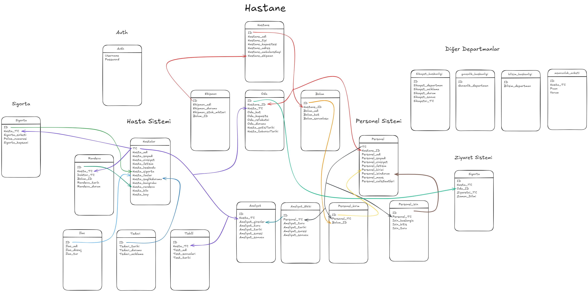

# Hospital Backend

The **Hospital Backend** is a Node.js-based API developed to manage hospital operations. It provides tools for handling hospital staff, patients, equipment, appointments, surgeries, and other related tasks efficiently.

## Features

- Patient and staff management
- Equipment and room tracking
- Appointment scheduling and management
- Surgery team and procedure handling
- Laboratory test and treatment records
- Complaint management system
- Insurance information tracking

## Requirements

To run this project, you need the following installed on your machine:

- [Node.js](https://nodejs.org/) (v18 or higher)
- [MySQL](https://www.mysql.com/) (v7.1 or higher)

## Installation

1. Clone the repository:

   ```bash
   git clone https://github.com/xrenata/hospitalbackend.git
   cd hospitalbackend
   ```

2. Install the required dependencies:

   ```bash
   npm install
   ```

3. Create the MySQL database by running:

   ```sql
   CREATE DATABASE HospitalManagement;
   ```

4. Set up the `.env` file in the project root and add the following environment variables:

   ```plaintext
   # Database Variables
   MYSQL_USER=root
   DATABASE_NAME=HospitalManagement
   DATABASE_HOST=localhost
   DATABASE_PASSWORD=your-password

   # Express Variables
   HOST=localhost
   PORT=3000
   ```

7. Start the server:

   ```bash
   npm start
   ```

# Improved API Endpoints Documentation

I've reorganized the API endpoints by resource type and ensured consistent formatting:

## Authentication
| HTTP Method | Endpoint | Description |
|------------|----------|-------------|
| POST | `/api/auth/register` | Create a new user |
| POST | `/api/auth/login` | Login to user account |

## Hospitals
| HTTP Method | Endpoint | Description |
|------------|----------|-------------|
| GET | `/api/hospitals` | Get a list of all hospitals |
| GET | `/api/hospitals/{hospital_id}` | Get a specific hospital |
| POST | `/api/hospitals` | Create a new hospital |
| PUT | `/api/hospitals/{hospital_id}` | Update a specific hospital |
| DELETE | `/api/hospitals/{hospital_id}` | Delete a specific hospital |

## Patients
| HTTP Method | Endpoint | Description |
|------------|----------|-------------|
| GET | `/api/patients` | Get a list of all patients |
| GET | `/api/patients/{patient_id}` | Get a specific patient |
| POST | `/api/patients` | Register a new patient |
| PUT | `/api/patients/{patient_id}` | Update a specific patient |
| DELETE | `/api/patients/{patient_id}` | Delete a specific patient |

## Appointments
| HTTP Method | Endpoint | Description |
|------------|----------|-------------|
| GET | `/api/appointments` | List all appointments |
| GET | `/api/appointments/{appointment_id}` | Get a specific appointment |
| POST | `/api/appointments` | Create a new appointment |
| PUT | `/api/appointments/{appointment_id}` | Update a specific appointment |
| DELETE | `/api/appointments/{appointment_id}` | Delete a specific appointment |

## Surgeries
| HTTP Method | Endpoint | Description |
|------------|----------|-------------|
| GET | `/api/surgeries` | List all surgeries |
| GET | `/api/surgeries/{surgery_id}` | Get a specific surgery |
| POST | `/api/surgeries` | Create a new surgery |
| PUT | `/api/surgeries/{surgery_id}` | Update a specific surgery |
| DELETE | `/api/surgeries/{surgery_id}` | Delete a specific surgery |

## Surgery Teams
| HTTP Method | Endpoint | Description |
|------------|----------|-------------|
| GET | `/api/surgery-team` | List all surgery teams |
| GET | `/api/surgery-team/{surgery_team_id}` | Get a specific surgery team |
| POST | `/api/surgery-team` | Create a new surgery team |
| PUT | `/api/surgery-team/{surgery_team_id}` | Update a specific surgery team |
| DELETE | `/api/surgery-team/{surgery_team_id}` | Delete a specific surgery team |

## Staff
| HTTP Method | Endpoint | Description |
|------------|----------|-------------|
| GET | `/api/staff` | List all staff members |
| GET | `/api/staff/{staff_id}` | Get a specific staff member |
| POST | `/api/staff` | Create a new staff member |
| PUT | `/api/staff/{staff_id}` | Update a specific staff member |
| DELETE | `/api/staff/{staff_id}` | Delete a specific staff member |

## Staff Departments
| HTTP Method | Endpoint | Description |
|------------|----------|-------------|
| GET | `/api/staff_departments` | List all staff departments |
| GET | `/api/staff_departments/{staff_department_id}` | Get a specific staff department |
| POST | `/api/staff_departments` | Create a new staff department |
| PUT | `/api/staff_departments/{staff_department_id}` | Update a specific staff department |
| DELETE | `/api/staff_departments/{staff_department_id}` | Delete a specific staff department |

## Rooms
| HTTP Method | Endpoint | Description |
|------------|----------|-------------|
| GET | `/api/rooms` | List all rooms |
| GET | `/api/rooms/{room_id}` | Get a specific room |
| POST | `/api/rooms` | Create a new room |
| PUT | `/api/rooms/{room_id}` | Update a specific room |
| DELETE | `/api/rooms/{room_id}` | Delete a specific room |

## Medications
| HTTP Method | Endpoint | Description |
|------------|----------|-------------|
| GET | `/api/medications` | List all medications |
| GET | `/api/medications/{medication_id}` | Get a specific medication |
| POST | `/api/medications` | Create a new medication |
| PUT | `/api/medications/{medication_id}` | Update a specific medication |
| DELETE | `/api/medications/{medication_id}` | Delete a specific medication |

## Insurance
| HTTP Method | Endpoint | Description |
|------------|----------|-------------|
| GET | `/api/insurance` | List all insurance policies |
| GET | `/api/insurance/{id}` | Get a specific insurance policy |
| POST | `/api/insurance` | Create a new insurance policy |
| PUT | `/api/insurance/{id}` | Update a specific insurance policy |
| DELETE | `/api/insurance/{id}` | Delete a specific insurance policy |

## Visits
| HTTP Method | Endpoint | Description |
|------------|----------|-------------|
| GET | `/api/visits` | List all visits |
| GET | `/api/visits/{id}` | Get a specific visit |
| POST | `/api/visits` | Create a new visit |
| PUT | `/api/visits/{id}` | Update a specific visit |
| DELETE | `/api/visits/{id}` | Delete a specific visit |

## Prescriptions
| HTTP Method | Endpoint | Description |
|------------|----------|-------------|
| GET | `/api/prescriptions` | List all prescriptions |
| GET | `/api/prescriptions/{id}` | Get a specific prescription |
| POST | `/api/prescriptions` | Create a new prescription |
| PUT | `/api/prescriptions/{id}` | Update a specific prescription |
| DELETE | `/api/prescriptions/{id}` | Delete a specific prescription |

## Shifts
| HTTP Method | Endpoint | Description |
|------------|----------|-------------|
| GET | `/api/shifts` | List all shifts |
| GET | `/api/shifts/{id}` | Get a specific shift |
| POST | `/api/shifts` | Create a new shift |
| PUT | `/api/shifts/{id}` | Update a specific shift |
| DELETE | `/api/shifts/{id}` | Delete a specific shift |

## Feedback
| HTTP Method | Endpoint | Description |
|------------|----------|-------------|
| GET | `/api/feedback` | List all feedback |
| GET | `/api/feedback/{id}` | Get a specific feedback |
| POST | `/api/feedback` | Create a new feedback |
| PUT | `/api/feedback/{id}` | Update a specific feedback |
| DELETE | `/api/feedback/{id}` | Delete a specific feedback |

**Swagger:** You can reach full documentation from [Swagger](http://localhost:3000/api-docs) on your local.

## Environment Variables Table

| Variable Name     | Description                         | Example Value        |
|-------------------|-------------------------------------|----------------------|
| `MYSQL_USER`      | MySQL username                     | `root`               |
| `DATABASE_NAME`   | Name of the database               | `HospitalManagement` |
| `DATABASE_HOST`   | Hostname or IP of the database      | `localhost`          |
| `DATABASE_PASSWORD` | MySQL user password              | `your-password`      |
| `HOST`            | Express server host address         | `localhost`          |
| `PORT`            | Port number for the Express server  | `3000`               |
| `JWT_SECRET`            | Secret key for jwt signature  | `secret`               |


## Database Schema

Below is the database schema for the Hospital Backend API:



## Project Structure

```plaintext
hospital-backend/src
├── src/
    ├── Routes/          # API endpoint routes
    ├── Controllers/     # Business logic controllers
    └── Modules/         # Helpers
├── .env                 # Environment variables file
├── package.json         # Project metadata and dependencies
└── README.md            # Documentation
```

## Technologies Used

- **Node.js**: Backend development
- **Express.js**: API routing
- **MySQL**: Relational database
- **dotenv**: Manage environment variables

## Contribution Guidelines

1. Fork this repository.
2. Create a new branch: `git checkout -b feature/new-feature`.
3. Make your changes and commit them: `git commit -m 'Add a new feature'`.
4. Push your branch: `git push origin feature/new-feature`.
5. Open a Pull Request.

## Contact

If you encounter any issues or have suggestions, feel free to reach out at:  
